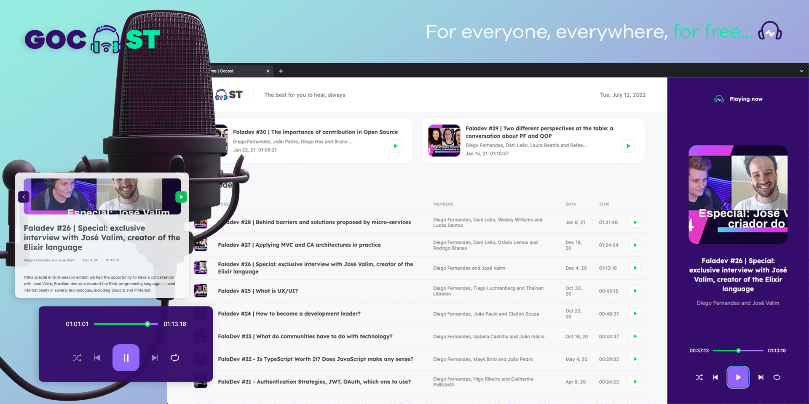

<h1 align="center">
  
</h1>

<h4 align="center">
  The best for you to hear, always
</h4>

<p align="center">
  

  

  <a href="https://www.linkedin.com/in/viniciumedeiros/">
    
  </a>

  <a href="https://github.com/viniciumedeiros/gocast/commits/master">
    
  </a>

  
   <a href="https://github.com/viniciumedeiros/gocast/stargazers">
    
  </a>
</p>
<p align="center">
  <a href="#-project">Project</a>&nbsp;&nbsp;&nbsp;|&nbsp;&nbsp;&nbsp;
  <a href="#-technologies">Technologies</a>&nbsp;&nbsp;&nbsp;|&nbsp;&nbsp;&nbsp;
  <a href="#-how-to-use">How to use</a>&nbsp;&nbsp;&nbsp;|&nbsp;&nbsp;&nbsp;
  <a href="#-how-to-contribute">How to contribute</a>&nbsp;&nbsp;&nbsp;|&nbsp;&nbsp;&nbsp;
  <a href="#-license">License</a>
</p>

## 💻 Project

Gocast is a platform built for podcast broadcasting.<br>
Wherever you are, whatever you want to hear, hear here. For everyone, everywhere, for free!

<div align="center">
    
</div>


## 🚀 Technologies

This project was developed with the following technologies:

- [ReactJS][reactjs]
- [Next.js][nextjs]
- [Typescript][typescript]

## 🌍 How To Use

To clone and run this application, you'll need [Git][git], [Node][node] + [Yarn][yarn] installed on your computer.

From your command line:

### Install Gocast

```bash
# Clone this repository
$ git clone https://github.com/viniciumedeiros/gocast

# Go into the repository
$ cd gocast/

# Install dependencies
$ yarn install

# Run the backend fake server
$ yarn server

# Run the web server
$ yarn dev

# running on port 3000
http://127.0.0.1:3000/
```

### Database Configuration

## 👽 How to contribute

-  Make a fork;
-  Create a branch with your feature: `git checkout -b my-feature`;
-  Commit changes: `git commit -m 'feat: My new feature'`;
-  Make a push to your branch: `git push origin my-feature`.

After merging your receipt request to done, you can delete a branch from yours.

## 📃 License

This project is under the MIT license. See the [LICENSE][license] for details.

---

🎓 Made with by Vinícius Medeiros 👨🏻‍💻 [Get in touch!][linkedin]

[reactjs]: https://reactjs.org/
[nextjs]: https://nextjs.org/
[typescript]: https://www.typescriptlang.org/
[node]: https://nodejs.org/
[yarn]: https://yarnpkg.com/
[git]: https://git-scm.com
[license]: https://github.com/viniciumedeiros/gocast/blob/master/LICENSE
[linkedin]: https://www.linkedin.com/in/viniciumedeiros/